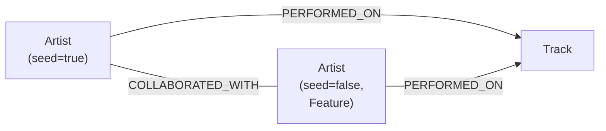
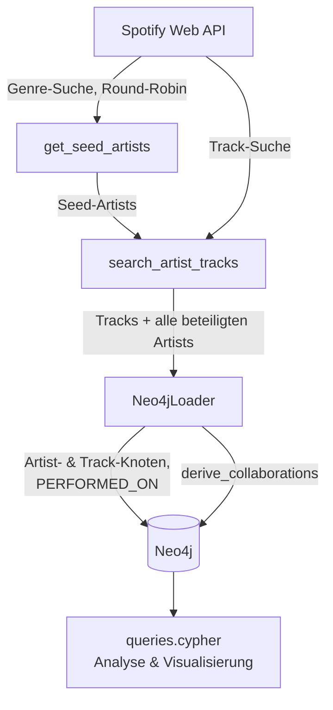

# Spotify Knowledge Graph

Eine Python-Pipeline, die Daten der **Spotify Web API** in einen **Knowledge Graph
in Neo4j** überführt. Im Zentrum steht die Frage: *Welche Künstler:innen arbeiten
zusammen?* — abgeleitet daraus, dass sie gemeinsam auf einem Track auftreten. Das
Ergebnis ist ein durchsuchbares Kollaborationsnetzwerk mit Analysen wie Degree
Centrality, kürzesten Pfaden ("Six Degrees of Spotify") und Community-Struktur.

> **Projektkontext:** Prüfungsleistung im Modul **DIS18**, **Gruppe 6**
> (Johnson Gaspar Baptista, Noah Anton Müller).

---

## Ziel

- Öffentliche Musikdaten in ein **Graphmodell** überführen und so Beziehungen
  sichtbar machen, die in einer relationalen Tabelle nur umständlich abfragbar wären.
- Das entstehende Netzwerk mit **reinen Cypher-Queries** analysieren
  (keine kostenpflichtigen Plugins nötig).
- Die Pipeline so dokumentieren, dass sie **nachgenutzt und weiterentwickelt**
  werden kann.

## Datenmodell (Concept Map)

Zwei Knotentypen, zwei Beziehungstypen:



| Knoten / Kante | Eigenschaften |
|---|---|
| **`Artist`** | `id`, `name`, `uri`, `seed` (true = per Suche gesammelt, false = über Track entdeckt), `genres`, `popularity`, `followers` |
| **`Track`** | `id`, `name`, `release_date`, `popularity`, `uri` |
| **`PERFORMED_ON`** | `Artist → Track` (Künstler:in wirkt am Track mit) |
| **`COLLABORATED_WITH`** | `Artist – Artist`, ungerichtet; Property `track_ids` = Liste gemeinsamer Tracks |

`COLLABORATED_WITH` wird **abgeleitet**: Stehen zwei Artists über `PERFORMED_ON`
am selben Track, entsteht eine Kollaborationskante.

> **Hinweis:** `genres`, `popularity` und `followers` liefert die Spotify-API im
> Development-Mode nicht mehr (siehe [Einschränkungen](#einschränkungen)). Der Kern
> des Graphen ist deshalb die **Netzwerkstruktur**, nicht die Metadaten.

## Architektur & Datenfluss



Die Pipeline läuft in vier Schritten (`main.py`):

1. **Artists sammeln** — Genre-Suche, balanciert im Round-Robin über die Seed-Genres,
   Stopp bei Zielanzahl (`TOP_N_ARTISTS`).
2. **Tracks abrufen** — pro Artist per Suche; jeder auf einem Track beteiligte
   Künstler wird mit erfasst.
3. **In Neo4j laden** — DB leeren, `Artist`- und `Track`-Knoten anlegen, über
   `PERFORMED_ON` verbinden. Feature-Artists werden dabei automatisch zu Knoten.
4. **Kollaborationen ableiten** — `COLLABORATED_WITH`-Kanten aus gemeinsamen Tracks.

| Datei | Rolle |
|---|---|
| `main.py` | Orchestriert die vier Schritte |
| `spotify_client.py` | Spotify-API-Zugriff, Rate-Limit-Handling, Sammellogik |
| `neo4j_loader.py` | Schreibt Knoten/Kanten nach Neo4j |
| `config.py` | Parameter (Artist-Anzahl, Track-Tiefe, Neo4j-Verbindung) |
| `queries.cypher` | Kommentierte Analyse- & Demo-Queries für den Neo4j Browser |
| `DOKUMENTATION.md` | Entwicklungsverlauf & Design-Entscheidungen |

## Voraussetzungen

- **Python 3.11+**
- **Neo4j 5.x / 2025+** (lokal, am einfachsten über [Neo4j Desktop](https://neo4j.com/download/))
- Ein **Spotify-Developer-Account** (kostenlos)

## Installation

### 1. Repository klonen

```powershell
git clone https://github.com/noahmll/spotify-KG.git
cd spotify-KG
```

### 2. Python-Umgebung & Abhängigkeiten

```powershell
python -m venv .venv
.\.venv\Scripts\Activate.ps1        # macOS/Linux: source .venv/bin/activate
pip install -r requirements.txt
```

### 3. Spotify-Zugang einrichten (Client ID & Secret)

Die Pipeline authentifiziert sich über den **Client-Credentials-Flow** — dafür
brauchst du eine ID und ein Secret aus einer eigenen Spotify-App:

1. Auf <https://developer.spotify.com/dashboard> mit deinem Spotify-Account einloggen.
2. **„Create app"** klicken. Beliebigen Namen/Beschreibung eingeben; als Redirect
   URI genügt `http://localhost:8888/callback` (wird bei diesem Flow nicht genutzt,
   ist aber Pflichtfeld). Unter „Which API/SDKs" **Web API** auswählen.
3. Nach dem Anlegen: **Settings** öffnen → **Client ID** kopieren und über
   **„View client secret"** das **Client Secret** anzeigen und kopieren.
4. Beide Werte kommen in die `.env` (Schritt 5).

### 4. Neo4j einrichten

1. Neo4j Desktop installieren und öffnen.
2. Eine **lokale Instanz** anlegen (**„Create instance"**), **Database user auf
   `neo4j` belassen**, ein Passwort setzen (min. 8 Zeichen) — dieses Passwort kommt
   in die `.env`.
3. Instanz **starten** (Status „running"). Sie lauscht dann auf `bolt://127.0.0.1:7687`.

### 5. `.env` anlegen

Die Vorlage kopieren und ausfüllen:

```powershell
copy .env.example .env               # macOS/Linux: cp .env.example .env
```

```dotenv
SPOTIFY_CLIENT_ID=deine_spotify_client_id
SPOTIFY_CLIENT_SECRET=dein_spotify_client_secret
NEO4J_PASSWORD=dein_neo4j_passwort
```

Die `.env` wird **nicht** eingecheckt (steht in `.gitignore`).

## Ausführen

Neo4j-Instanz muss laufen, dann:

```powershell
python main.py
```

Am Ende zeigt die Ausgabe die Knoten-/Kantenzahlen. Den Graphen erkundest du im
**Neo4j Browser** unter <http://localhost:7474> — Einstieg:

```cypher
MATCH (a:Artist) RETURN a LIMIT 25;
```

Die Daten bleiben in Neo4j **dauerhaft gespeichert**; ein erneuter `python main.py`-Lauf
ersetzt sie (die DB wird zu Beginn geleert).

## Konfiguration

In `config.py`:

| Parameter | Bedeutung |
|---|---|
| `TOP_N_ARTISTS` | Anzahl der per Suche gesammelten Seed-Artists (bestimmt Graphgröße & Kosten) |
| `TRACK_SEARCH_PAGES` | Such-Seiten à 10 Tracks pro Artist — mehr = mehr Tracks & Kollaborationen, aber mehr API-Anfragen |

Grobes Request-Budget: `TOP_N_ARTISTS × TRACK_SEARCH_PAGES` (Track-Phase dominiert).
Die Seed-Genres lassen sich in `spotify_client.py` (`SEED_GENRES`) anpassen.

## Beispiel-Queries

Vollständig kommentiert in [`queries.cypher`](queries.cypher). Auszug:

```cypher
// Top-Kollaborateure (Degree Centrality)
MATCH (a:Artist)-[:COLLABORATED_WITH]-()
RETURN a.name AS artist, count(*) AS kollaborationen
ORDER BY kollaborationen DESC LIMIT 10;

// Kürzester Pfad zwischen zwei Artists ("Six Degrees of Spotify")
MATCH p = shortestPath(
  (a:Artist {name: "Pitbull"})-[:COLLABORATED_WITH*..10]-(b:Artist {name: "Peso Pluma"})
)
RETURN p;

// Nur das Kollaborationsnetzwerk visualisieren (ohne Track-Knoten)
MATCH p = (:Artist)-[:COLLABORATED_WITH]-(:Artist)
RETURN p LIMIT 300;
```

## Einschränkungen

Die genutzte Spotify-App läuft im **Development-Mode** (Extended Access setzt seit
2025 eine registrierte Organisation mit ≥250.000 MAU voraus). Empirisch heißt das:

- Nur der **Such-Endpoint** ist nutzbar, mit **`limit ≤ 10`**.
- **`popularity`, `followers`, `genres`** kommen als `null` zurück — es gibt daher
  **kein Ranking-Kriterium**; die Auswahl folgt Spotifys Such-Relevanz-Reihenfolge,
  balanciert über Genres.
- **Batch-Abruf**, **Top-Tracks**, **Related Artists** und **Recommendations** sind
  gesperrt (403) bzw. seit Ende 2024 abgekündigt.

Der Wert des Projekts liegt entsprechend in der **Kollaborations-Topologie**, die
vollständig erhalten bleibt. Details zum Entwicklungsweg: [`DOKUMENTATION.md`](DOKUMENTATION.md).

## Projektstruktur

```
spotify-KG/
├── main.py             # Pipeline-Orchestrierung
├── spotify_client.py   # Spotify-API-Zugriff & Sammellogik
├── neo4j_loader.py     # Neo4j-Schreiblogik
├── config.py           # Parameter
├── queries.cypher      # Analyse- & Demo-Queries
├── requirements.txt    # Python-Abhängigkeiten
├── .env.example        # Vorlage für Zugangsdaten
├── DOKUMENTATION.md    # Entwicklungsverlauf & Design
└── README.md
```

## Lizenz

[MIT](LICENSE) — freie Nutzung, Veränderung und Weiterentwicklung.

## Autoren

**DIS18 – Gruppe 6:** Johnson Gaspar Baptista · Noah Anton Müller
